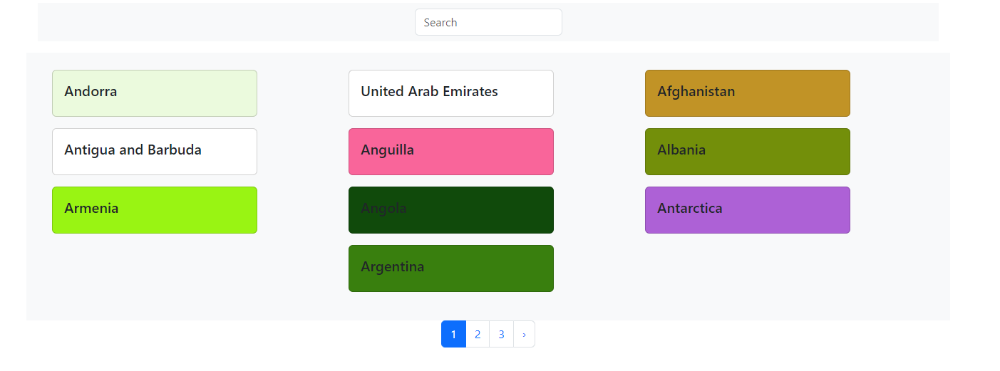
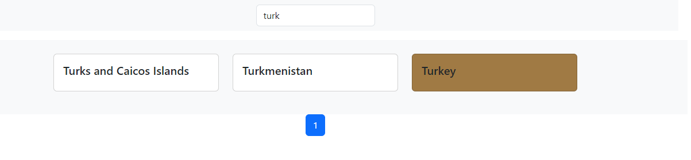

# React + Vite

This project was submitted by the Konzek company during the interview process.
In the project, it was requested to pull the data from the graphql api and display it on the screen and the data should be 10 on a page. When the city projected on the screen is clicked, it should have a different color than other cities and when the same city is clicked again, the color should be white.
It was requested that the cities could be found easily by searching.

 
